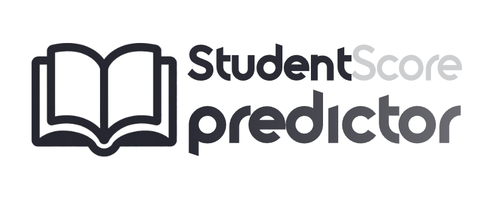

# Student Exam Score Predictor

A machine learning-powered web application that predicts student exam scores based on lifestyle factors, academic habits, and personal circumstances. Built with Streamlit and scikit-learn.



## Table of Contents

- [Overview](#overview)
- [Features](#features)
- [Project Structure](#project-structure)
- [Installation](#installation)
- [Usage](#usage)
- [Model Information](#model-information)
- [Technologies Used](#technologies-used)
- [Contributing](#contributing)
- [License](#license)

## Overview

This application uses machine learning to predict student exam scores by analyzing various lifestyle and academic factors including:
- Study habits and time management
- Sleep patterns and health metrics
- Social media and entertainment consumption
- Academic attendance and participation
- Socioeconomic factors

The goal is to help educators and students identify key factors that influence academic performance and make data-driven decisions to improve outcomes.

## Features

- **Interactive Web Interface**: Beautiful, user-friendly Streamlit application with custom styling
- **Real-time Predictions**: Instant score predictions based on input parameters
- **Multiple ML Models**: Trained and evaluated multiple regression models (Ridge, ElasticNet, Linear Regression, LinearSVR)
- **Comprehensive Input Fields**: 14 different lifestyle and academic parameters
- **Visual Feedback**: Grade scale reference and styled result displays
- **Responsive Design**: Clean, professional UI inspired by academic progress reports

## Project Structure

```
AI2Prjct/
│
├── .venv/                      # Virtual environment
├── .vscode/                    # VS Code configuration
├── assets/                     # Static assets
│   └── image.png              # Application logo
│
├── models/                     # Trained models and preprocessor
│   ├── preprocessor.pkl       # Data preprocessing pipeline
│   ├── Ridge_model.pkl        # Ridge regression model (primary)
│   ├── ElasticNet_model.pkl   # ElasticNet model
│   ├── LinearRegression_model.pkl
│   └── LinearSVR_model.pkl    # Support Vector Regression model
│
├── notebook/                   # Jupyter notebooks
│   └── ai2prjct.ipynb         # Model training and EDA notebook
│
├── src/                        # Source code
│   ├── __init__.py
│   ├── main.py                # Main Streamlit application
│   ├── data_loader.py         # Model and preprocessor loader
│   └── model.py               # Model utilities
│
├── utils/                      # Utility functions
│
├── .gitignore                 # Git ignore file
├── requirements.txt           # Python dependencies
└── README.md                  # Project documentation
```

## Installation

### Prerequisites

- Python 3.8 or higher
- pip package manager

### Setup Instructions

1. **Clone the repository**
   ```bash
   git clone https://github.com/yourusername/student-score-predictor.git
   cd student-score-predictor
   ```

2. **Create a virtual environment**
   ```bash
   python -m venv .venv
   ```

3. **Activate the virtual environment**
   - Windows:
     ```bash
     .venv\Scripts\activate
     ```
   - macOS/Linux:
     ```bash
     source .venv/bin/activate
     ```

4. **Install dependencies**
   ```bash
   pip install -r requirements.txt
   ```

## Usage

### Running the Application

1. Make sure you're in the project root directory and your virtual environment is activated

2. Run the Streamlit app:
   ```bash
   streamlit run src/main.py
   ```

3. Open your web browser and navigate to the URL shown in the terminal (typically `http://localhost:8501`)

4. Enter student information in the form fields:
   - **Personal Information**: Age, Gender, Parental Education, Part-time Job status
   - **Academic Information**: Study hours, Attendance, Internet quality, Extracurricular participation
   - **Lifestyle & Wellness**: Sleep, Diet, Exercise, Social media usage, Mental health rating

5. Click "Predict Exam Score" to get the prediction

### Sample Input

```
Age: 18
Gender: Female
Study Hours: 5
Attendance: 95%
Sleep Hours: 8
Diet Quality: Good
Mental Health: High well-being
```

## Model Information

### Training Process

The model was trained on a comprehensive dataset of student lifestyle and academic factors. The training process included:

1. **Exploratory Data Analysis (EDA)**: Analysis of feature correlations and distributions
2. **Data Preprocessing**: Handling missing values, encoding categorical variables, feature scaling
3. **Model Selection**: Evaluation of multiple regression algorithms
4. **Hyperparameter Tuning**: Optimization of model parameters
5. **Model Validation**: Cross-validation and performance metrics

### Models Evaluated

- **Ridge Regression** (Primary Model) ✅
- ElasticNet Regression
- Linear Regression
- Linear Support Vector Regression (LinearSVR)

### Features Used

**Numerical Features:**
- Age
- Study hours per day
- Social media hours per day
- Netflix hours per day
- Attendance percentage
- Sleep hours per day

**Categorical Features:**
- Gender
- Part-time job status
- Diet quality
- Parental education level
- Internet quality
- Extracurricular participation
- Exercise frequency
- Mental health rating

## Technologies Used

- **Python 3.8+**: Core programming language
- **Streamlit**: Web application framework
- **scikit-learn**: Machine learning library
- **Pandas**: Data manipulation and analysis
- **NumPy**: Numerical computing
- **Joblib**: Model serialization
- **Pillow (PIL)**: Image processing

## Model Performance

The Ridge regression model was selected as the primary model based on its performance metrics during validation. Detailed performance metrics and comparisons can be found in the Jupyter notebook (`notebook/ai2prjct.ipynb`).

## UI Design

The application features a custom-designed interface inspired by academic progress reports with:
- Sage green and terracotta color scheme
- Montserrat typography
- Responsive layout with organized sections
- Smooth animations and hover effects
- Grade scale reference for easy interpretation

## Contributing

Contributions are welcome! Please follow these steps:

1. Fork the repository
2. Create a new branch (`git checkout -b feature/improvement`)
3. Make your changes
4. Commit your changes (`git commit -am 'Add new feature'`)
5. Push to the branch (`git push origin feature/improvement`)
6. Create a Pull Request

## License

This project is licensed under the MIT License - see the [LICENSE](LICENSE) file for details.

## Authors

- Wahb Mohamed - Initial work

## Acknowledgments

- Dataset providers
- Streamlit community
- scikit-learn documentation and examples

## Contact

For questions or feedback, please open an issue on GitHub or contact [wahbmohamed407@gmail.com]

---

**Note**: This application is for educational and informational purposes only. Predictions should not be the sole basis for important academic decisions.